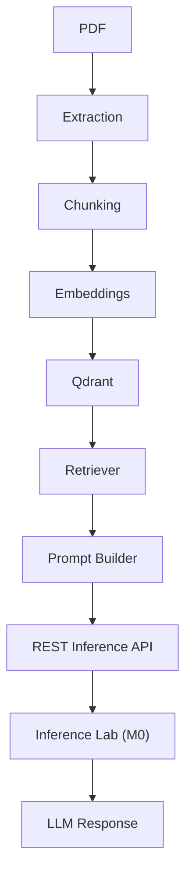

# Knowledge Vault

*A local-first PDF Retrieval-Augmented Generation (RAG) engine.*

Knowledge Vault turns PDFs into grounded, source-backed answers through semantic retrieval. It forms the retrieval layer of a modular local AI stack while delegating model inference to Inference Lab (M0) over REST.

This repository implements **Milestone 1 (M1)** of a modular Local AI stack. It is responsible for:

- PDF ingestion
- text extraction
- recursive chunking
- embedding generation
- vector indexing in Qdrant
- semantic retrieval
- prompt construction
- REST-based generation orchestration

It is intentionally separate from Milestone 0, [Inference Lab](https://github.com/Jaival-Suthar/inference-lab), which provides the local LLM runtime, model management, benchmarking, telemetry, and the generation REST API.

Inference Lab (M0) provides the model-serving layer over REST. Knowledge Vault prepares the context, retrieves relevant passages, and sends prompts to M0 for generation. The split is deliberate and gives each layer independent versioning, deployment, scaling, reuse, and room for future milestones.

## At A Glance

- **🎯 Problem:** turn uploaded PDFs into queryable, source-backed context for local AI applications.
- **🧩 Purpose:** keep document ingestion, retrieval, and prompt orchestration separate from model serving.
- **🏗 Architecture:** Knowledge Vault handles retrieval; Inference Lab handles inference.
- **⚙ Responsibilities:** M1 ingests, chunks, embeds, indexes, retrieves, and orchestrates; M0 serves the model and generates responses.

## Core Stack

**Python** • **FastAPI** • **Qdrant** • **PyMuPDF** • **Sentence Transformers** • **Docker**

## Design Principles

- Local-first by default
- Modular architecture
- API-first design
- Reusable AI infrastructure
- Separation of retrieval and inference

## Architecture



## End-to-End Pipeline

```text
Upload PDF
  -> compute SHA256 document_fingerprint
  -> detect duplicates
  -> extract text with PyMuPDF
  -> recursively chunk text
  -> generate embeddings
  -> store chunks in Qdrant
  -> return document metadata

Question Answering
  -> embed the user question
  -> retrieve top-k chunks from Qdrant
  -> apply similarity threshold and metadata filters
  -> build a prompt with source attribution
  -> call POST http://localhost:4000/v1/generate
  -> return answer + sources + latency metrics
```

## Setup

### Prerequisites

- Python 3.11+
- `uv`
- Qdrant
- [Inference Lab (M0)](https://github.com/Jaival-Suthar/inference-lab)

M1 expects the generation API to be available at `http://localhost:4000/v1/generate` unless `GENERATION_PROVIDER_URL` is overridden.

### With `uv`

```bash
uv sync --dev
uv run uvicorn app.main:app --reload --port 8000
```

### With Docker

```bash
docker compose up --build
```

The compose stack starts:

- Qdrant on `localhost:6333`
- the FastAPI app on `localhost:8000`

Inference Lab (M0) must be running separately and reachable at `http://localhost:4000/v1/health` and `http://localhost:4000/v1/generate`.

## Configuration

Copy `.env.example` to `.env` and adjust as needed.

Key environment variables:

- `QDRANT_URL`: Qdrant base URL
- `QDRANT_COLLECTION`: collection name for indexed chunks
- `GENERATION_PROVIDER_URL`: M0 generation endpoint
- `GENERATION_TIMEOUT_SECONDS`: timeout for provider requests
- `GENERATION_RETRY_COUNT`: retry count for provider failures
- `EMBEDDING_MODEL_NAME`: embedding model name
- `EMBEDDING_DEVICE`: `cpu` or `cuda`
- `EMBEDDING_DIMENSION`: embedding vector size
- `CHUNK_MAX_TOKENS`: recursive chunk size
- `CHUNK_OVERLAP_TOKENS`: chunk overlap
- `RETRIEVAL_TOP_K_DEFAULT`: fallback top-k for retrieval
- `RETRIEVAL_SIMILARITY_THRESHOLD`: minimum normalized similarity score
- `DUPLICATE_UPLOAD_POLICY`: `reject`, `replace`, or `allow`
- `PROMPT_TOKEN_BUDGET`: prompt budget for the prompt builder

## REST API

Interactive API Documentation (Swagger UI)

- `http://localhost:8000/docs`

OpenAPI schema:

- `http://localhost:8000/openapi.json`

### Health

```bash
curl http://localhost:8000/v1/health
```

Response:

```json
{
  "status": "ok",
  "qdrant_connected": true,
  "inference_lab_connected": true
}
```

### Upload

```bash
curl -F "file=@/path/to/document.pdf" http://localhost:8000/v1/upload
```

Response:

```json
{
  "doc_id": "4ab40322-a9d6-4e3c-97a9-20b73bd29daf",
  "filename": "document.pdf",
  "chunk_count": 9,
  "status": "ready"
}
```

### Chat

```bash
curl -X POST http://localhost:8000/v1/chat \
  -H "Content-Type: application/json" \
  -d '{
    "message": "What does the document say about setup?",
    "doc_id": null,
    "top_k": 5,
    "stream": false
  }'
```

Response:

```json
{
  "answer": "…",
  "sources": [
    {
      "doc_id": "…",
      "filename": "document.pdf",
      "chunk_id": "…",
      "chunk_index": 1,
      "text": "…",
      "score": 0.73,
      "page_number": 2,
      "section_title": "2. Calculator API"
    }
  ],
  "latency_ms": {
    "embedding": 12,
    "retrieval": 8,
    "llm": 5883,
    "total": 5903
  }
}
```

## Offline Evaluation

Run the evaluation suite and emit a JSON report:

```bash
uv run pdf-rag-eval --questions eval/questions.json --output eval-report.json
```

Metrics include:

- Retrieval Precision
- Recall@k
- Latency
- Answer Faithfulness
- Context Utilisation

## Performance Benchmarking

Run the benchmark suite and emit a JSON report:

```bash
uv run pdf-rag-benchmark --output benchmark-report.json
```

The benchmark reports:

- local file-write latency
- extraction latency
- embedding latency
- retrieval latency
- generation latency
- total end-to-end latency

This is a local-stage benchmark; its file-write measurement is not an HTTP `POST /v1/upload` latency measurement.

## Related Projects

- [Inference Lab (M0)](https://github.com/Jaival-Suthar/inference-lab): provides model serving, inference, benchmarking, and telemetry. Knowledge Vault calls it over REST for generation, rather than embedding a model runtime here.
- Future milestones of the Local AI stack—including long-term memory, knowledge graphs, evaluation, planning, and autonomous agents—will build on this retrieval layer while continuing to consume Inference Lab (M0) as the inference backend.

## Known Limitations

- Generation depends on the external M0 service being available at `GENERATION_PROVIDER_URL`.
- Qdrant must be running before upload or chat requests can succeed.
- The repository does not ship a standalone model runtime.
- Concurrent uploads of the same document fingerprint can race in this milestone because the duplicate check and ingestion write are not atomic.

## Future Work

- Richer evaluation datasets and scoring.
- Optional re-ranking improvements.
- Additional ingestion formats beyond PDF.
- Broader observability and deployment automation.

## Troubleshooting

- If `POST /v1/chat` returns `502`, confirm Inference Lab is running and `http://localhost:4000/v1/generate` responds successfully.
- If uploads fail with `409`, the document fingerprint already exists and `DUPLICATE_UPLOAD_POLICY=reject`.
- If Qdrant is unreachable, confirm the container is running and port `6333` is free.
- If embeddings are slow, try `EMBEDDING_DEVICE=cuda` during bulk ingestion.
