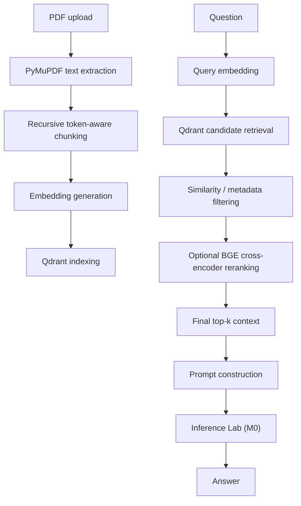

# Knowledge Vault

A local-first PDF retrieval engine for source-attributed question answering.

Knowledge Vault is Milestone 1 (M1) of a modular local AI stack. It ingests text-layer PDFs, builds searchable chunks, retrieves candidate context from Qdrant, optionally reranks that context with a BGE cross-encoder, and sends source-attributed prompts to Inference Lab (M0) for generation.

## M1 Scope

M1 covers:

- PDF ingestion and document fingerprinting
- page-level text extraction with PyMuPDF
- recursive token-aware chunking
- embedding generation
- Qdrant vector indexing and retrieval
- similarity and metadata filtering
- optional BGE cross-encoder reranking
- source-attributed prompt construction
- REST generation orchestration
- offline evaluation
- stage-level latency benchmarking

M1 does not attempt to solve OCR or scanned PDFs, multi-source ingestion, large-scale distributed retrieval, or production-scale evaluation infrastructure.

## At A Glance

| Item | Summary |
| --- | --- |
| Problem | Turn PDFs into retrievable context for local question answering. |
| Purpose | Keep retrieval, ranking, and generation boundaries explicit. |
| Architecture | Knowledge Vault handles ingestion, retrieval, reranking, and prompt construction; Inference Lab (M0) handles model serving and generation. |
| M1 focus | Measure and understand the retrieval layer. |
| Retrieval approach | Dense retrieval, optional cross-encoder reranking, then fixed-size prompt context. |

## Core Stack

Python, FastAPI, Qdrant, PyMuPDF, Sentence Transformers, Docker.

## Design Principles

- Local-first
- Modular architecture
- API-first design
- Reusable AI infrastructure
- Separation of retrieval and inference

## Architecture



## Retrieval Pipeline

```text
Question
  -> Query embedding
  -> Qdrant candidate retrieval
  -> similarity / metadata filtering
  -> optional BGE cross-encoder reranking
  -> final top-k context
  -> prompt construction
  -> Inference Lab (M0)
```

- `candidate_k` is the number of retrieved chunks exposed to the reranker.
- `top_k` is the number of chunks kept as final LLM context.
- Increasing `candidate_k` can recover missed evidence, but it also increases distractor space for the reranker.

## End-to-End Pipeline

### Ingestion

```text
PDF
  -> compute SHA256 document fingerprint
  -> detect duplicates
  -> extract page text with PyMuPDF
  -> recursively chunk text by tokens
  -> generate embeddings
  -> index chunks in Qdrant
```

### Question Answering

```text
Question
  -> embed the query
  -> retrieve candidate chunks from Qdrant
  -> apply similarity and metadata filters
  -> optionally rerank with a BGE cross-encoder
  -> keep final top-k context
  -> build a source-attributed prompt
  -> call Inference Lab (M0)
```

## M1 Evaluation

M1 evaluation used one 214-page document and 35 controlled questions spanning factual, conceptual, paraphrased, section-specific, multi-part, chunk-boundary-sensitive, and deliberately unanswerable prompts.

| Run | Retrieval | Reranking | Candidate Pool | Purpose |
| --- | --- | --- | --- | --- |
| Run 1 | Dense | Off | -- | Baseline |
| Run 2 | Dense | On | Baseline | Test reranking |
| Run 3 | Dense | On | 20 | Test larger candidate pool |

The final context size remained fixed at `top_k=5`. Stage-level latency instrumentation recorded embedding, retrieval, rerank, LLM, and total timing.

Passage-level machine-checked gold evidence was not established for every question, so this evaluation does not prove retrieval accuracy with Recall@k, MRR, or NDCG.

## M1 Findings

- Reranking changed Top-1 on 27/35 queries (77.1%), but this measures ranking changes, not improvement.
- Reranking added approximately 2.9 seconds of mean overhead.
- Qdrant retrieval remained approximately 8-9 ms p50.
- Increasing `rerank_candidate_k` to 20 changed only 6/35 Top-1 results and did not consistently improve retrieval.
- Contents and Index pages sometimes ranked highly despite being weak evidence.
- At least one generated answer was plausible but factually inconsistent with the source.

M1 did not establish that reranking universally improves retrieval quality. It established measurable trade-offs and concrete failure modes.

## Setup

### Prerequisites

- Python 3.11+
- `uv`
- Qdrant
- [Inference Lab (M0)](https://github.com/Jaival-Suthar/inference-lab)

M1 expects the generation API to be available at `http://localhost:4000/v1/generate` unless `GENERATION_PROVIDER_URL` is overridden.

### With `uv`

```bash
uv sync --dev
uv run uvicorn app.main:app --reload --port 8000
```

### With Docker

```bash
docker compose up --build
```

The compose stack starts:

- Qdrant on `localhost:6333`
- the FastAPI app on `localhost:8000`

Inference Lab (M0) must be running separately and reachable at `http://localhost:4000/v1/health` and `http://localhost:4000/v1/generate`.

## Configuration

Copy `.env.example` to `.env` and adjust as needed.

Key environment variables:

- `APP_ENV`: application environment label
- `DEBUG`: enable debug mode
- `DATA_DIR`: on-disk storage root
- `QDRANT_URL`: Qdrant base URL
- `QDRANT_COLLECTION`: collection name for indexed chunks
- `GENERATION_PROVIDER_URL`: M0 generation endpoint
- `GENERATION_TIMEOUT_SECONDS`: timeout for provider requests
- `GENERATION_RETRY_COUNT`: retry count for provider failures
- `EMBEDDING_MODEL_NAME`: embedding model name
- `EMBEDDING_DEVICE`: `cpu` or `cuda`
- `EMBEDDING_DIMENSION`: embedding vector size
- `EMBEDDING_VERSION`: stored embedding version tag
- `CHUNK_MAX_TOKENS`: recursive chunk size
- `CHUNK_OVERLAP_TOKENS`: chunk overlap
- `RETRIEVAL_TOP_K_DEFAULT`: fallback retrieval `top_k`
- `RETRIEVAL_SIMILARITY_THRESHOLD`: minimum normalized similarity score
- `RE_RANK_ENABLED`: enable or disable reranking
- `RE_RANK_MODEL_NAME`: cross-encoder model name
- `RERANK_CANDIDATE_K`: rerank candidate pool size
- `PROMPT_TOKEN_BUDGET`: prompt budget for the prompt builder
- `DUPLICATE_UPLOAD_POLICY`: `reject`, `replace`, or `allow`

## REST API

Interactive API documentation:

- `http://localhost:8000/docs`

OpenAPI schema:

- `http://localhost:8000/openapi.json`

### Health

```bash
curl http://localhost:8000/v1/health
```

Response:

```json
{
  "status": "ok",
  "qdrant_connected": true,
  "inference_lab_connected": true
}
```

### Upload

```bash
curl -F "file=@/path/to/document.pdf" http://localhost:8000/v1/upload
```

Response:

```json
{
  "doc_id": "4ab40322-a9d6-4e3c-97a9-20b73bd29daf",
  "filename": "document.pdf",
  "chunk_count": 9,
  "status": "ready"
}
```

### Chat

```bash
curl -X POST http://localhost:8000/v1/chat \
  -H "Content-Type: application/json" \
  -d '{
    "message": "What does the document say about setup?",
    "doc_id": null,
    "top_k": 5,
    "stream": false
  }'
```

Response:

```json
{
  "answer": "...",
  "sources": [
    {
      "doc_id": "...",
      "filename": "document.pdf",
      "chunk_id": "...",
      "chunk_index": 1,
      "text": "...",
      "score": 0.73,
      "page_number": 2,
      "section_title": "2. Calculator API"
    }
  ],
  "latency_ms": {
    "embedding": 12,
    "retrieval": 8,
    "rerank": 4,
    "llm": 5883,
    "total": 5907
  }
}
```

## Offline Evaluation

```bash
uv run pdf-rag-eval --questions eval/questions.json --output eval-report.json
```

The current evaluation script reports heuristic retrieval_precision, recall_at_k, generation_latency_ms, latency_ms, answer_faithfulness, and context_utilisation over the provided question set.

- Retrieval precision and recall are based on `expected_doc_id` and `expected_chunk_keywords`, not machine-checked passage-level ground truth.
- Answer faithfulness and context utilisation are token-overlap heuristics between the answer and retrieved context.
- Passage-level gold evidence, Recall@k, MRR, and NDCG are next evaluation refinements if you need stricter retrieval-grounding measurement.

## Performance Benchmarking

```bash
uv run pdf-rag-benchmark --output benchmark-report.json
```

The benchmark reports:

- local file-write latency
- extraction latency
- embedding latency
- retrieval latency
- generation latency
- total end-to-end latency

Rerank latency is available in chat and evaluation telemetry when reranking is enabled, but the standalone benchmark command does not isolate it as a separate stage.

This is a local-stage benchmark; its file-write measurement is not an HTTP `POST /v1/upload` latency measurement.

## Related Projects

- [Inference Lab (M0)](https://github.com/Jaival-Suthar/inference-lab): provides model serving and generation over REST. Knowledge Vault calls it rather than hosting a local model runtime.

Knowledge Vault is designed as an independently versioned retrieval subsystem within a modular local AI stack.

## Known Limitations

- Generation depends on the external M0 service being available at `GENERATION_PROVIDER_URL`.
- Qdrant must be running before upload or chat requests can succeed.
- The repository does not ship a standalone model runtime.
- OCR and scanned PDFs are out of scope for M1.
- Concurrent uploads of the same document fingerprint can race because the duplicate check and ingestion write are not atomic.
- Passage-level machine-checked ground truth is still missing for the evaluation set.
- Reranking adds measurable latency, so the retrieval path has a speed-versus-rank-quality trade-off.

## Next Engineering Questions

- Establish passage-level ground truth for the evaluation set.
- Compute Recall@k, MRR, and NDCG against that ground truth.
- Compare rerank candidate pools systematically.
- Test document-structure-aware retrieval against Contents/Index failure cases.
- Reduce the deployment footprint.

## Troubleshooting

- If `POST /v1/chat` returns `502`, confirm Inference Lab is running and `http://localhost:4000/v1/generate` responds successfully.
- If uploads return `409`, the document fingerprint already exists and `DUPLICATE_UPLOAD_POLICY=reject`.
- If Qdrant is unreachable, confirm the container is running and port `6333` is free.
- If embeddings are slow, try `EMBEDDING_DEVICE=cuda` during bulk ingestion.

## License

MIT
