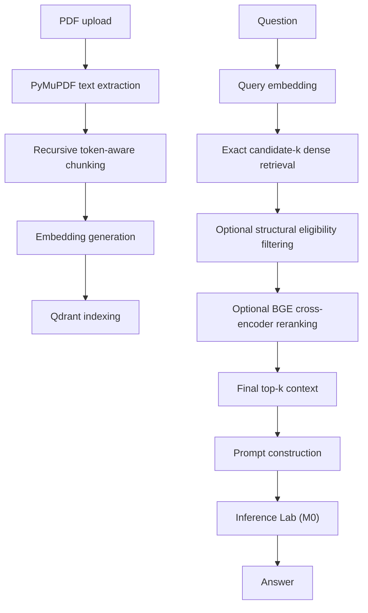

# Knowledge Vault

A local-first PDF retrieval engine for source-attributed question answering.

Knowledge Vault is Milestone 1 (M1) of a modular local AI stack. It ingests text-layer PDFs, builds searchable chunks, retrieves candidate context from Qdrant, optionally reranks that context with a BGE cross-encoder, and sends source-attributed prompts to Inference Lab (M0) for generation.

## M1 Scope

M1 covers:

- PDF ingestion and document fingerprinting
- page-level text extraction with PyMuPDF
- recursive token-aware chunking
- embedding generation
- Qdrant vector indexing and retrieval
- passage-level gold-evidence evaluation
- reranker failure analysis
- document-structure-aware retrieval experiments
- similarity and metadata filtering
- optional BGE cross-encoder reranking
- source-attributed prompt construction
- REST generation orchestration
- offline evaluation
- stage-level latency benchmarking

M1 does not attempt to solve OCR or scanned PDFs, multi-source ingestion, large-scale distributed retrieval, or production-scale evaluation infrastructure. Complex extraction cases such as tables and multi-column layouts have not yet been systematically evaluated.

## At A Glance

| Item | Summary |
| --- | --- |
| Problem | Turn PDFs into retrievable context for local question answering. |
| Purpose | Keep retrieval, ranking, and generation boundaries explicit. |
| Architecture | Knowledge Vault handles ingestion, retrieval, reranking, and prompt construction; Inference Lab (M0) handles model serving and generation. |
| M1 focus | Measure and understand the retrieval layer. |
| Retrieval approach | Dense retrieval, optional cross-encoder reranking, then fixed-size prompt context. |

## Core Stack

Python, FastAPI, Qdrant, PyMuPDF, Sentence Transformers, Docker.

## Design Principles

- Local-first
- Modular architecture
- API-first design
- Reusable AI infrastructure
- Separation of retrieval and inference

## Architecture



## Retrieval Pipeline

```text
Question
  -> Query embedding
  -> exact candidate-k dense retrieval
  -> structural eligibility filtering
  -> optional BGE cross-encoder reranking
  -> final top-k context
  -> prompt construction
  -> Inference Lab (M0)
```

- `candidate_k` is the number of dense candidates exposed to the reranker.
- `top_k` is the number of chunks kept as final LLM context.
- Increasing `candidate_k` can improve candidate recall, but it also increases the distractor space presented to the reranker.
- In the M1 benchmark, candidate Recall@20 reached 83.3%, while final Recall@5 was 66.7% before structural filtering.

Structural filtering is an opt-in stage that occurs after dense retrieval and before reranking. It does not delete structural chunks from the corpus; it only controls whether they are eligible for the evidence-oriented reranking path.

## End-to-End Pipeline

### Ingestion

```text
PDF
  -> compute SHA256 document fingerprint
  -> detect duplicates
  -> extract page text with PyMuPDF
  -> recursively chunk text by tokens
  -> generate embeddings
  -> index chunks in Qdrant
```

### Question Answering

```text
Question
  -> embed the query
  -> retrieve candidate chunks from Qdrant
  -> apply structural eligibility filtering
  -> optionally rerank with a BGE cross-encoder
  -> keep final top-k context
  -> build a source-attributed prompt
  -> call Inference Lab (M0)
```

## M1 Research History

### `research(m1): establish retrieval evaluation infrastructure`

M1 evaluation uses one 214-page document and 35 controlled questions spanning factual, conceptual, paraphrased, section-specific, multi-part, chunk-boundary-sensitive, and deliberately unanswerable prompts.

The benchmark artifacts record:

- machine-checked gold evidence
- retrieval precision and retrieval-hit metrics
- strict recall at `k`
- candidate recall
- MRR
- nDCG
- stage-level latency
- validation errors for malformed question/evidence specifications
- reproducible JSON artifacts with per-question `candidate_chunks` and `retrieved_chunks`

The baseline dense evaluation artifact is [`eval/results/m1-baseline-dense-v2.json`](./eval/results/m1-baseline-dense-v2.json), which reports:

- `questions`: 35
- `strict_metrics_questions`: 30
- `retrieval_precision`: 0.12
- `retrieval_hit_at_k`: 0.37142857142857144
- `recall_at_1`: 0.36666666666666664
- `recall_at_5`: 0.6666666666666666
- `mrr`: 0.49444444444444446
- `ndcg_at_5`: 0.42744436929724366
- `latency_ms`: 14133.742857142857

### `research(m1): benchmark dense retrieval and reranking`

The benchmark matrix was designed to separate candidate depth from reranking.

| Checkpoint | Artifact | Candidate K | Reranking | Retrieval Precision | Retrieval Hit@K | Recall@1 | Recall@5 | MRR | nDCG@5 | Latency (ms) |
| --- | --- | --- | --- | --- | --- | --- | --- | --- | --- | --- |
| Dense k5 | [`m1-baseline-dense-v2.json`](./eval/results/m1-baseline-dense-v2.json) | 5 | Off | 0.12 | 0.37142857142857144 | 0.36666666666666664 | 0.6666666666666666 | 0.49444444444444446 | 0.42744436929724366 | 14133.742857142857 |
| Dense k20 | [`m1-dense-k20-v2.json`](./eval/results/m1-dense-k20-v2.json) | 20 | Off | 0.12 | 0.37142857142857144 | 0.36666666666666664 | 0.6666666666666666 | 0.49444444444444446 | 0.42744436929724366 | 13981.8 |
| Rerank k5 | [`m1-rerank-k5-v2.json`](./eval/results/m1-rerank-k5-v2.json) | 5 | On | 0.12 | 0.37142857142857144 | 0.4 | 0.6666666666666666 | 0.5066666666666667 | 0.4292780273639158 | 16342.514285714286 |
| Rerank k20 | [`m1-rerank-k20-v2.json`](./eval/results/m1-rerank-k20-v2.json) | 20 | On | 0.13142857142857142 | 0.42857142857142855 | 0.2 | 0.6666666666666666 | 0.39111111111111113 | 0.3478832487999445 | 20919.485714285714 |

The rerank-k20 run showed that widening the candidate pool can recover more candidate evidence, but the reranker can still move correct chunks out of the final top-5 context.

### RQ3: When correct evidence exists in candidate-k=20, why can reranking lose it from final top-k=5?

The rerank-k20 benchmark showed that widening the candidate pool increased candidate recall but did not improve final evidence ranking. For this corpus, candidate Recall@20 reached 83.3%, while final Recall@5 was 66.7%.

Failure analysis identified structurally non-substantive chunks such as CONTENTS, INDEX, COPYRIGHT, and GLOSSARY as high-similarity distractors in several cases.

Hypothesis:

"Structural candidates can interfere with reranking when they are treated as ordinary substantive evidence."

A structural eligibility filter was implemented after dense retrieval and before reranking. It excludes CONTENTS, INDEX, COPYRIGHT, and GLOSSARY candidates while leaving dense retrieval scores and reranker scoring unchanged.

The controlled before/after experiment produced:

| Metric | Baseline | Structural filter |
| --- | ---: | ---: |
| Candidate Recall@20 | 83.3% | 83.3% |
| Recall@1 | 20.0% | 20.0% |
| Recall@5 | 66.7% | 70.0% |
| MRR | 0.3911 | 0.4022 |
| nDCG@5 | 0.3561 | 0.3722 |

The experiment artifacts are:

- `eval/results/m1-rq3-baseline-k20-v1.json`
- `eval/results/m1-rq3-structural-filter-k20-v1.json`
- `eval/results/rq3-score-margin-analysis-v1.json`

The result supports the hypothesis as a contributing factor, but not as a complete explanation of reranking failures. Structural filtering improved Recall@5, MRR, and nDCG@5 while leaving Recall@1 and candidate Recall@20 unchanged.

## M1 Research Conclusion

M1 showed that increasing the reranking candidate pool does not guarantee better final evidence retrieval. In the evaluated corpus, dense candidate Recall@20 reached 83.3%, while final Recall@5 was 66.7%.

Failure analysis identified structurally non-substantive chunks as recurring high-similarity distractors. Filtering CONTENTS, INDEX, COPYRIGHT, and GLOSSARY candidates before reranking improved Recall@5 from 66.7% to 70.0%, MRR from 0.3911 to 0.4022, and nDCG@5 from 0.3561 to 0.3722.

The intervention did not improve Recall@1 or candidate Recall@20, so structural filtering is treated as a contributing factor rather than a complete solution to reranking failures.

M1 therefore closes with a better understanding of retrieval failure modes rather than a claim of production-grade retrieval quality.

## Setup

### Prerequisites

- Python 3.11+
- `uv`
- Qdrant
- [Inference Lab (M0)](https://github.com/Jaival-Suthar/inference-lab)

M1 expects the generation API to be available at `http://localhost:4000/v1/generate` unless `GENERATION_PROVIDER_URL` is overridden.

### With `uv`

```bash
uv sync --dev
uv run uvicorn app.main:app --reload --port 8000
```

### With Docker

```bash
docker compose up --build
```

The compose stack starts:

- Qdrant on `localhost:6333`
- the FastAPI app on `localhost:8000`

Inference Lab (M0) must be running separately and reachable at `http://localhost:4000/v1/health` and `http://localhost:4000/v1/generate`.

## Configuration

Copy `.env.example` to `.env` and adjust as needed.

Key environment variables:

- `APP_ENV`: application environment label
- `DEBUG`: enable debug mode
- `DATA_DIR`: on-disk storage root
- `QDRANT_URL`: Qdrant base URL
- `QDRANT_COLLECTION`: collection name for indexed chunks
- `GENERATION_PROVIDER_URL`: M0 generation endpoint
- `GENERATION_TIMEOUT_SECONDS`: timeout for provider requests
- `GENERATION_RETRY_COUNT`: retry count for provider failures
- `EMBEDDING_MODEL_NAME`: embedding model name
- `EMBEDDING_DEVICE`: `cpu` or `cuda`
- `EMBEDDING_DIMENSION`: embedding vector size
- `EMBEDDING_VERSION`: stored embedding version tag
- `CHUNK_MAX_TOKENS`: recursive chunk size
- `CHUNK_OVERLAP_TOKENS`: chunk overlap
- `RETRIEVAL_TOP_K_DEFAULT`: fallback retrieval `top_k`
- `RETRIEVAL_SIMILARITY_THRESHOLD`: minimum normalized similarity score
- `RE_RANK_ENABLED`: enable or disable reranking
- `RE_RANK_MODEL_NAME`: cross-encoder model name
- `RERANK_CANDIDATE_K`: rerank candidate pool size
- `RETRIEVAL_STRUCTURAL_FILTER_ENABLED`: opt-in structural eligibility filter before reranking
- `PROMPT_TOKEN_BUDGET`: prompt budget for the prompt builder
- `DUPLICATE_UPLOAD_POLICY`: `reject`, `replace`, or `allow`

## REST API

Interactive API documentation:

- `http://localhost:8000/docs`

OpenAPI schema:

- `http://localhost:8000/openapi.json`

### Health

```bash
curl http://localhost:8000/v1/health
```

Response:

```json
{
  "status": "ok",
  "qdrant_connected": true,
  "inference_lab_connected": true
}
```

### Upload

```bash
curl -F "file=@/path/to/document.pdf" http://localhost:8000/v1/upload
```

Response:

```json
{
  "doc_id": "4ab40322-a9d6-4e3c-97a9-20b73bd29daf",
  "filename": "document.pdf",
  "chunk_count": 9,
  "status": "ready"
}
```

### Chat

```bash
curl -X POST http://localhost:8000/v1/chat \
  -H "Content-Type: application/json" \
  -d '{
    "message": "What does the document say about setup?",
    "doc_id": null,
    "top_k": 5,
    "stream": false
  }'
```

Response:

```json
{
  "answer": "...",
  "sources": [
    {
      "doc_id": "...",
      "filename": "document.pdf",
      "chunk_id": "...",
      "chunk_index": 1,
      "text": "...",
      "score": 0.73,
      "page_number": 2,
      "section_title": "2. Calculator API"
    }
  ],
  "latency_ms": {
    "embedding": 12,
    "retrieval": 8,
    "rerank": 4,
    "llm": 5883,
    "total": 5907
  }
}
```

## Offline Evaluation

```bash
uv run pdf-rag-eval --questions eval/questions.json --output eval-report.json
```

The evaluation pipeline now reports both heuristic answer-level metrics and strict passage-level retrieval metrics.

It includes:

- Recall@1
- Recall@5
- Recall@20
- MRR
- nDCG@5
- candidate recall
- generation latency
- stage-level latency

The older retrieval precision and retrieval-hit metrics are heuristic and use `expected_doc_id` and `expected_chunk_keywords`. The strict Recall@k, MRR, and nDCG metrics use the machine-checked passage-level gold-evidence annotations.

Evaluation artifacts preserve per-question candidate chunks, retrieved chunks, dense scores, reranker scores, candidate ranks, final ranks, and structural categories for analysis.

- Retrieval precision and retrieval-hit metrics are based on `expected_doc_id` and `expected_chunk_keywords`, not machine-checked passage-level gold evidence.
- Answer faithfulness and context utilisation are token-overlap heuristics between the answer and retrieved context and should not be treated as semantic evaluation.

For the controlled structural-filter experiment, use:

```bash
uv run pdf-rag-eval --questions eval/questions-gold-evidence-v1.json --output eval/results/m1-rq3-structural-filter-k20-v1.json --structural-filter-enabled
```

The baseline and filtered experiments keep `candidate_k=20` and `top_k=5` constant.

## Performance Benchmarking

```bash
uv run pdf-rag-benchmark --output benchmark-report.json
```

The benchmark reports:

- local file-write latency
- extraction latency
- embedding latency
- retrieval latency
- generation latency
- total end-to-end latency

Rerank latency is available in chat and evaluation telemetry when reranking is enabled, but the standalone benchmark command does not isolate it as a separate stage.

This is a local-stage benchmark; its file-write measurement is not an HTTP `POST /v1/upload` latency measurement.

## Related Projects

- [Inference Lab (M0)](https://github.com/Jaival-Suthar/inference-lab): provides model serving and generation over REST. Knowledge Vault calls it rather than hosting a local model runtime.

Knowledge Vault is designed as an independently versioned retrieval subsystem within a modular local AI stack.

## Known Limitations

- Generation depends on the external M0 service being available at `GENERATION_PROVIDER_URL`.
- Qdrant must be running before upload or chat requests can succeed.
- The repository does not ship a standalone model runtime.
- The current gold-evidence benchmark uses one 214-page text-layer PDF.
- Tables, multi-column layouts, reading-order corruption, headers/footers, and OCR/scanned PDFs have not yet been systematically evaluated.
- The question set contains related and near-duplicate questions, so raw question counts should not automatically be interpreted as independent failure counts.
- Concurrent uploads of the same document fingerprint can race because the duplicate check and ingestion write are not atomic.
- Reranking adds measurable latency, so the retrieval path has a speed-versus-rank-quality trade-off.

## Next Engineering Questions

- Investigate the remaining gap between candidate Recall@20 and final Recall@5.
- Evaluate hybrid dense + BM25 retrieval and reciprocal rank fusion in M2.
- Determine whether structural metadata should influence retrieval, fusion, or reranking.
- Expand extraction evaluation to tables, multi-column layouts, headers/footers, and reading-order failures.
- Continue improving deployment efficiency and footprint.

## Troubleshooting

- If `POST /v1/chat` returns `502`, confirm Inference Lab is running and `http://localhost:4000/v1/generate` responds successfully.
- If uploads return `409`, the document fingerprint already exists and `DUPLICATE_UPLOAD_POLICY=reject`.
- If Qdrant is unreachable, confirm the container is running and port `6333` is free.
- If embeddings are slow, try `EMBEDDING_DEVICE=cuda` during bulk ingestion.

## License

MIT
