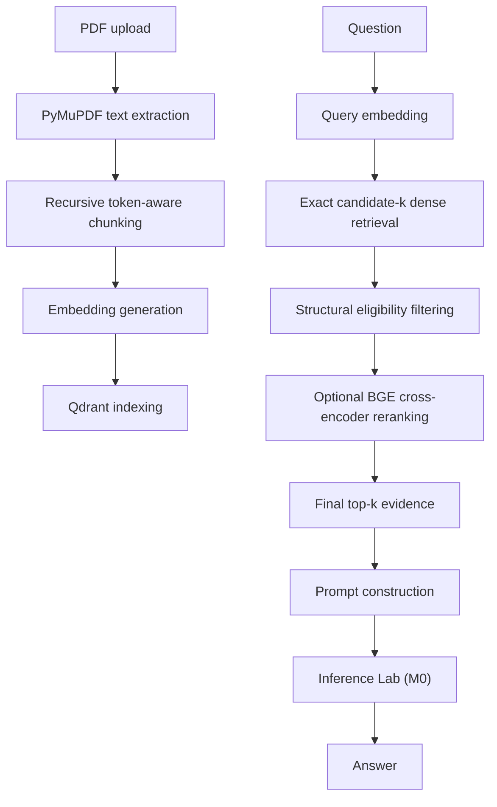

# Knowledge Vault

A local-first PDF retrieval engine for source-attributed question answering.

Knowledge Vault is Milestone 1 (M1) of a modular local AI stack. It ingests text-layer PDFs, builds searchable chunks, retrieves candidate context from Qdrant, optionally filters structurally ineligible candidates, reranks evidence with a BGE cross-encoder, and sends source-attributed prompts to Inference Lab (M0) for generation.

**Current release: v1.2.0 — Retrieval Evaluation & Failure Analysis**

---

## M1 Scope

M1 covers:

- PDF ingestion and document fingerprinting
- Page-level text extraction with PyMuPDF
- Recursive token-aware chunking
- Embedding generation
- Qdrant vector indexing and retrieval
- Passage-level gold-evidence evaluation
- Candidate-level retrieval evaluation
- Cross-encoder reranking
- Reranker failure analysis
- Document-structure-aware retrieval experiments
- Structural eligibility filtering
- Similarity and metadata filtering
- Source-attributed prompt construction
- REST generation orchestration
- Offline evaluation
- Stage-level latency benchmarking

M1 does not attempt to solve OCR or scanned PDFs, multi-source ingestion, large-scale distributed retrieval, or production-scale evaluation infrastructure.

Complex extraction cases such as tables, multi-column layouts, reading-order corruption, headers/footers, and OCR/scanned PDFs have not yet been systematically evaluated.

---

## At A Glance

| Item | Summary |
| --- | --- |
| Problem | Turn PDFs into retrievable evidence for local question answering. |
| Purpose | Keep retrieval, ranking, evidence selection, and generation boundaries explicit. |
| Architecture | Knowledge Vault handles ingestion, retrieval, reranking, and prompt construction; Inference Lab (M0) handles model serving and generation. |
| M1 focus | Measure, diagnose, and improve the retrieval layer. |
| Retrieval approach | Dense retrieval, optional structural eligibility filtering, optional cross-encoder reranking, then fixed-size prompt context. |
| Current release | v1.2.0 — Retrieval Evaluation & Failure Analysis |

---

## Core Stack

- Python
- FastAPI
- Qdrant
- PyMuPDF
- Sentence Transformers
- Docker
- Inference Lab (M0)

---

## Design Principles

- Local-first
- Modular architecture
- API-first design
- Reusable AI infrastructure
- Separation of retrieval and inference
- Evidence-oriented evaluation
- Reproducible experiments
- Controlled interventions over uncontrolled tuning

---

# Architecture



Knowledge Vault owns the retrieval side of the system.

Inference Lab (M0) owns model serving and generation.

The service boundary is intentionally kept separate so retrieval and inference can evolve independently.

---

# Retrieval Pipeline

```text
Question
  -> Query embedding
  -> Exact candidate-k dense retrieval
  -> Structural eligibility filtering
  -> Optional BGE cross-encoder reranking
  -> Final top-k evidence
  -> Prompt construction
  -> Inference Lab (M0)
  -> Source-attributed answer
```

Two parameters are particularly important:

- `candidate_k`: number of dense candidates exposed to the reranking stage.
- `top_k`: number of chunks retained as final LLM context.

Increasing `candidate_k` can improve candidate recall, but it also increases the number of potentially distracting candidates presented to the reranker.

Structural filtering occurs after dense retrieval and before reranking.

It does **not** delete structural chunks from the corpus or Qdrant. It controls whether selected structural categories are eligible for the evidence-oriented reranking path.

---

# M1 Retrieval Evaluation

The most significant change in the later M1 research cycle was moving from answer-level inspection to passage-level retrieval evaluation.

A generated answer can look plausible even when the retriever failed to retrieve the evidence needed to support it.

M1 therefore evaluates the retrieval pipeline separately from generation.

The evaluation boundary is:

```text
Question
   |
   v
Gold evidence
   |
   +----> Was gold evidence retrieved?
   |
   v
Candidate pool
   |
   +----> Did reranking retain it?
   |
   v
Final evidence
   |
   v
Generation
```

This separates candidate retrieval failure from reranking failure.

---

# Controlled Evaluation Set

The M1 benchmark uses one 214-page text-layer PDF and 35 controlled questions.

Of the 35 questions:

- 30 are used for strict retrieval metrics
- 5 are deliberately unanswerable

The evaluation artifacts preserve:

- machine-checked gold evidence
- candidate chunks
- retrieved chunks
- dense scores
- reranker scores
- candidate ranks
- final ranks
- structural categories
- validation status
- latency measurements

---

# Retrieval Metrics

The strict passage-level evaluation includes:

- Recall@1
- Recall@5
- Recall@20
- MRR
- nDCG@5
- candidate Recall@k

Heuristic retrieval metrics are retained for continuity, but are not treated as substitutes for passage-level gold-evidence evaluation.

---

# M1 Research Progression

```text
Evaluation infrastructure
        |
        v
Dense and reranking benchmark
        |
        v
Reranker failure instrumentation
        |
        v
Evidence failure validation
        |
        v
Structural filtering experiment
```

The purpose was to avoid changing multiple variables at once and to narrow each subsequent engineering question.

---

## 1. Evaluation Infrastructure

The baseline artifact is:

[`eval/results/m1-baseline-dense-v2.json`](./eval/results/m1-baseline-dense-v2.json)

| Metric | Dense baseline |
| --- | ---: |
| Questions | 35 |
| Strict-metric questions | 30 |
| Recall@1 | 36.67% |
| Recall@5 | 66.67% |
| MRR | 0.4944 |
| nDCG@5 | 0.4274 |

This established a measurable retrieval boundary and separated candidate coverage from final ranking quality.

---

# 2. Dense Retrieval and Reranking Benchmark

| Configuration | Candidate K | Reranking | Recall@1 | Recall@5 | MRR | nDCG@5 |
| --- | ---: | --- | ---: | ---: | ---: | ---: |
| Dense k=5 | 5 | Off | 36.7% | 66.7% | 0.4944 | 0.4274 |
| Dense k=20 | 20 | Off | 36.7% | 66.7% | 0.4944 | 0.4274 |
| Rerank k=5 | 5 | On | **40.0%** | 66.7% | **0.5067** | 0.4293 |
| Rerank k=20 | 20 | On | **20.0%** | 66.7% | **0.3911** | **0.3479** |

Artifacts:

- [`eval/results/m1-baseline-dense-v2.json`](./eval/results/m1-baseline-dense-v2.json)
- [`eval/results/m1-dense-k20-v2.json`](./eval/results/m1-dense-k20-v2.json)
- [`eval/results/m1-rerank-k5-v2.json`](./eval/results/m1-rerank-k5-v2.json)
- [`eval/results/m1-rerank-k20-v2.json`](./eval/results/m1-rerank-k20-v2.json)

For k=20 reranking, candidate Recall@20 reached **83.3%**, while final Recall@5 remained **66.7%**.

This produced the next question:

> **When the correct evidence is already somewhere inside candidate-k=20, what causes it to disappear from final top-k?**

---

# 3. Reranker Failure Instrumentation

The analysis records:

- candidate rank
- final rank
- dense score
- reranker score
- structural category
- gold-evidence presence
- gold final rank
- replacement chunks

The forensic analysis identified:

- 40 cases where gold evidence was present in candidate-k=20
- 24 cases where it survived into final top-5
- 16 gold-evidence losses after reranking

For 12 analyzable losses:

| Measurement | Value |
| --- | ---: |
| Mean gold reranker score | 0.1827 |
| Mean replacement score | 0.7915 |
| Mean score margin | 0.6088 |
| Median score margin | 0.6713 |

The analyzed failures were therefore often decisive ranking errors rather than tiny score fluctuations.

---

# 4. Evidence Failure Validation

Individual inspection showed that highly similar candidates were not always answer-bearing evidence.

Structural material included:

- `CONTENTS`
- `INDEX`
- `COPYRIGHT`
- `GLOSSARY`

A Table of Contents can contain conceptually important terms while only indicating where a concept appears.

This creates a distinction between:

```text
Navigation relevance
        !=
Evidence relevance
```

Structural chunks are not inherently useless. They can be useful for navigation-oriented questions. The problem is treating them as interchangeable with substantive passages during evidence-oriented ranking.

---

# 5. Benchmark Validation and Artifact Provenance

During evidence validation, a stale gold-evidence identifier was found in an earlier evaluation artifact.

The underlying question/evidence mapping had subsequently been corrected in the evaluation data, but not every previously generated result artifact had been regenerated from the updated annotations.

This highlighted an important reproducibility requirement:

> **Evaluation results must be interpreted together with the exact question set and evidence specification used to produce them.**

Future benchmark tooling should validate:

- evidence specification structure
- referenced chunk identifiers
- existence of referenced chunks
- benchmark version/provenance

---

# RQ3 — Structural Eligibility Before Reranking

The hypothesis was:

> **Structural candidates can interfere with reranking when they are treated as ordinary substantive evidence.**

The intervention kept the following unchanged:

- embedding model
- Qdrant
- dense retrieval
- candidate count
- final top-k
- reranker model
- reranker scoring
- question set

Only structural eligibility filtering was added between dense retrieval and reranking.

```text
Dense retrieval
      |
      v
Candidate pool
      |
      v
Structural eligibility filter
      |
      v
Reranker
      |
      v
Final top-k
```

The structural filter does not delete structural chunks from Qdrant. It only prevents selected structural categories from participating in the evidence-oriented reranking path.

---

# Structural Filter Results

The controlled before/after experiment used:

```text
candidate_k = 20
top_k = 5
```

| Metric | Baseline | Structural Filter | Change |
| --- | ---: | ---: | ---: |
| Candidate Recall@20 | 83.3% | 83.3% | — |
| Recall@1 | 20.0% | 20.0% | — |
| Recall@5 | 66.7% | **70.0%** | **+3.3 pp** |
| MRR | 0.3911 | **0.4022** | +0.0111 |
| nDCG@5 | 0.3561 | **0.3722** | +0.0161 |

Artifacts:

- [`eval/results/m1-rq3-baseline-k20-v1.json`](./eval/results/m1-rq3-baseline-k20-v1.json)
- [`eval/results/m1-rq3-structural-filter-k20-v1.json`](./eval/results/m1-rq3-structural-filter-k20-v1.json)
- [`eval/results/rq3-reranker-analysis-v1.json`](./eval/results/rq3-reranker-analysis-v1.json)
- [`eval/results/rq3-score-margin-analysis-v1.json`](./eval/results/rq3-score-margin-analysis-v1.json)

The intervention improved Recall@5, MRR, and nDCG@5 without changing candidate Recall@20 or Recall@1.

Therefore:

> **Structural filtering is a contributing intervention, not a complete solution to reranking failure.**

---

# Example: Q022

Q022 asks:

> What is the relationship between 10X goals and 10X actions according to the author?

The correct evidence was already present in candidate-k=20.

Baseline:

```text
Candidate Recall@20 = 1
Recall@5 = 0
MRR = 0
nDCG@5 = 0
```

After structural filtering:

```text
Candidate Recall@20 = 1
Recall@5 = 1
MRR = 0.2
nDCG@5 = 0.3869
```

---

# Example: Q004

Q004 asks:

> What does the fourth degree of action mean?

Before filtering:

```text
Gold rank = 5
MRR = 0.20
nDCG@5 = 0.3869
```

After filtering:

```text
Gold rank = 4
MRR = 0.25
nDCG@5 = 0.4307
```

This demonstrates a smaller ranking improvement without changing candidate recall.

---

# M1 Research Conclusion

M1 does not establish that the BGE reranker is intrinsically poor.

It does not establish that structural chunks cause all reranking failures.

It does not establish that structural filtering will generalize to every document.

The narrower result is:

> **In this benchmark and corpus, structural document content created measurable ranking interference, and excluding selected structural categories from the evidence-ranking path improved final Recall@5 from 66.7% to 70.0%.**

The intervention did not change candidate Recall@20 or Recall@1.

Structural filtering therefore addressed one part of the ranking problem while leaving a substantial residual failure surface.

---

# What M1 Taught About Candidate Pools

More candidates provide more recall opportunity, but also more distractor opportunity.

```text
Candidate recall
       +
Candidate quality
       +
Candidate diversity
       -
Candidate noise
       |
       v
Reranking difficulty
```

Increasing `candidate_k` should therefore not be treated as an unconditional improvement.

Candidate composition matters.

The relevant question is not simply:

> How many candidates can the reranker see?

It is:

> **How useful are the candidates it is allowed to choose from?**

---

# Evaluation Is Now Part of the System

Before instrumentation:

> "The answer is wrong."

After instrumentation:

> "The gold evidence entered the top-20 dense candidate set but was displaced before final top-5."

The debugging loop is now:

```text
Was gold evidence retrieved?
        |
        +---- No
        |      |
        |      v
        |   Investigate candidate retrieval
        |
        +---- Yes
               |
               v
        What displaced it?
               |
               v
        What type of chunk?
               |
               v
        What were the scores?
               |
               v
        What intervention addresses it?
               |
               v
        Re-run the benchmark
```

This turns an aggregate RAG failure into a sequence of testable hypotheses.

---

# Known Limitations

### Corpus scope

The controlled benchmark uses one 214-page text-layer PDF. Results should be interpreted as corpus-specific experimental evidence rather than universal RAG conclusions.

### Extraction scope

The following have not yet been systematically evaluated:

- scanned PDFs
- OCR
- complex tables
- multi-column layouts
- reading-order corruption
- headers and footers
- complex document structures

### Benchmark independence

The question set contains related and near-duplicate questions. Multiple questions can expose the same underlying retrieval failure mode.

### Structural filtering

Structural filtering is currently an evidence-oriented intervention. A structural chunk may still be useful for navigation-oriented questions.

### Generation

Generation quality is evaluated separately from retrieval quality. A strong retrieval score does not guarantee a faithful generated answer.

### Reranking latency

Reranking introduces additional latency, creating a trade-off between candidate depth, ranking quality, and response time.

---

# Offline Evaluation

```bash
uv run pdf-rag-eval --questions eval/questions.json --output eval-report.json
```

For the controlled structural-filter experiment:

```bash
uv run pdf-rag-eval \
  --questions eval/questions-gold-evidence-v1.json \
  --output eval/results/m1-rq3-structural-filter-k20-v1.json \
  --structural-filter-enabled
```

The baseline and filtered RQ3 experiments keep:

```text
candidate_k = 20
top_k = 5
```

constant.

---

# Evaluation Artifacts

- [`eval/results/m1-baseline-dense-v2.json`](./eval/results/m1-baseline-dense-v2.json)
- [`eval/results/m1-dense-k20-v2.json`](./eval/results/m1-dense-k20-v2.json)
- [`eval/results/m1-rerank-k5-v2.json`](./eval/results/m1-rerank-k5-v2.json)
- [`eval/results/m1-rerank-k20-v2.json`](./eval/results/m1-rerank-k20-v2.json)
- [`eval/results/m1-rq3-baseline-k20-v1.json`](./eval/results/m1-rq3-baseline-k20-v1.json)
- [`eval/results/m1-rq3-structural-filter-k20-v1.json`](./eval/results/m1-rq3-structural-filter-k20-v1.json)
- [`eval/results/rq3-reranker-analysis-v1.json`](./eval/results/rq3-reranker-analysis-v1.json)
- [`eval/results/rq3-score-margin-analysis-v1.json`](./eval/results/rq3-score-margin-analysis-v1.json)

These artifacts allow aggregate metrics to be traced back to individual retrieval and ranking behavior.

---

# Performance Benchmarking

```bash
uv run pdf-rag-benchmark --output benchmark-report.json
```

The benchmark reports:

- local file-write latency
- extraction latency
- embedding latency
- retrieval latency
- generation latency
- total end-to-end latency

Rerank latency is available in chat and evaluation telemetry when reranking is enabled.

---

# Setup

## Prerequisites

- Python 3.11+
- `uv`
- Qdrant
- [Inference Lab (M0)](https://github.com/Jaival-Suthar/inference-lab)

Knowledge Vault expects the generation API at:

```text
http://localhost:4000/v1/generate
```

unless `GENERATION_PROVIDER_URL` is overridden.

## With `uv`

```bash
uv sync --dev
uv run uvicorn app.main:app --reload --port 8000
```

## With Docker

```bash
docker compose up --build
```

Qdrant runs on `localhost:6333` and Knowledge Vault on `localhost:8000`.

Inference Lab (M0) runs separately.

---

# Configuration

Copy `.env.example` to `.env` and adjust as needed.

Important environment variables include:

- `APP_ENV`
- `DEBUG`
- `DATA_DIR`
- `QDRANT_URL`
- `QDRANT_COLLECTION`
- `GENERATION_PROVIDER_URL`
- `GENERATION_TIMEOUT_SECONDS`
- `GENERATION_RETRY_COUNT`
- `EMBEDDING_MODEL_NAME`
- `EMBEDDING_DEVICE`
- `EMBEDDING_DIMENSION`
- `EMBEDDING_VERSION`
- `CHUNK_MAX_TOKENS`
- `CHUNK_OVERLAP_TOKENS`
- `RETRIEVAL_TOP_K_DEFAULT`
- `RETRIEVAL_SIMILARITY_THRESHOLD`
- `RE_RANK_ENABLED`
- `RE_RANK_MODEL_NAME`
- `RERANK_CANDIDATE_K`
- `RETRIEVAL_STRUCTURAL_FILTER_ENABLED`
- `PROMPT_TOKEN_BUDGET`
- `DUPLICATE_UPLOAD_POLICY`

---

# REST API

Interactive API documentation:

```text
http://localhost:8000/docs
```

OpenAPI schema:

```text
http://localhost:8000/openapi.json
```

## Health

```bash
curl http://localhost:8000/v1/health
```

## Upload

```bash
curl -F "file=@/path/to/document.pdf" \
  http://localhost:8000/v1/upload
```

## Chat

```bash
curl -X POST http://localhost:8000/v1/chat \
  -H "Content-Type: application/json" \
  -d '{
    "message": "What does the document say about setup?",
    "doc_id": null,
    "top_k": 5,
    "stream": false
  }'
```

---

# Related Projects

- [Inference Lab (M0)](https://github.com/Jaival-Suthar/inference-lab) — model serving and generation over REST.

Knowledge Vault is designed as an independently versioned retrieval subsystem within a modular local AI stack.

---

# Next Engineering Questions

M1 closes with a measurable gap between candidate retrieval and final evidence selection.

The next research direction is **Milestone 2 (M2)**:

```text
                    Query
                      |
             +--------+--------+
             |                 |
             v                 v
      Dense retrieval       BM25
             |                 |
             +--------+--------+
                      |
                      v
                 RRF fusion
                      |
                      v
                  Reranking
                      |
                      v
                 Final evidence
```

The next experiments will investigate:

- hybrid dense + BM25 retrieval
- reciprocal rank fusion
- complementary lexical and semantic retrieval signals
- whether hybrid retrieval improves candidate coverage
- whether improved candidate composition improves final ranking
- how structural metadata should influence retrieval and reranking
- the remaining gap between candidate Recall@20 and final Recall@5

The goal is not to assume that hybrid retrieval will solve the remaining problem.

The goal is to test whether a different retrieval signal provides complementary evidence coverage.

---

# Troubleshooting

### `POST /v1/chat` returns `502`

Confirm that Inference Lab is running and that:

```text
http://localhost:4000/v1/generate
```

responds successfully.

### Upload returns `409`

The document fingerprint already exists. Check:

```text
DUPLICATE_UPLOAD_POLICY
```

### Qdrant is unreachable

Confirm that Qdrant is running and that port `6333` is available.

### Embeddings are slow

For bulk ingestion, try:

```text
EMBEDDING_DEVICE=cuda
```

when CUDA is available.

---

# Release History

## v1.2.0 — Retrieval Evaluation & Failure Analysis

Current release.

Focus:

- passage-level gold evidence
- candidate Recall@k
- MRR
- nDCG@5
- dense vs reranked retrieval benchmarking
- reranker failure instrumentation
- structural failure analysis
- structural eligibility filtering
- controlled before/after evaluation
- reproducible retrieval artifacts

Key result:

```text
Candidate Recall@20 = 83.3%

Recall@5
66.7% -> 70.0%

MRR
0.3911 -> 0.4022

nDCG@5
0.3561 -> 0.3722
```

---

## v1.1.0 — Retrieval Evaluation & Reranking

Knowledge Vault v1.1.0 introduced:

- BGE cross-encoder reranking
- configurable reranking candidate pools
- controlled offline evaluation
- stage-level latency measurements
- retrieval and generation behavior analysis
- retrieval failure investigation
- semantic relevance vs evidentiary usefulness analysis

The release established the initial reranking benchmark and identified the need for passage-level gold-evidence evaluation.

---

## v1.0.0 — Initial PDF RAG System

Knowledge Vault v1.0.0 introduced the first public retrieval layer of the Local AI Stack.

It included:

- PDF ingestion with PyMuPDF
- recursive text chunking
- embedding generation with Sentence Transformers
- vector indexing and semantic retrieval using Qdrant
- source-attributed prompt construction
- REST-based generation orchestration through Inference Lab (M0)
- FastAPI endpoints for upload, chat, and health
- offline evaluation and performance benchmarking utilities

---

# License

MIT
